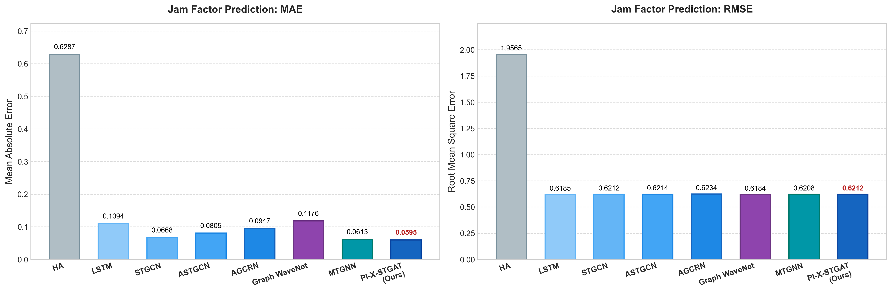

# PI-X-STGAT

**Physics-Informed Explainable Spatial-Temporal Graph Attention Network for traffic forecasting and interpretable congestion propagation analysis**

[](https://doi.org/10.32604/cmes.2026.086216)
[](LICENSE)
[](https://www.python.org/)

English | [繁體中文](README.zh-TW.md)

This repository is the official implementation and experiment archive for the published article:

> Yan-Wei Li and David Chunhu Li, “A Physics-Informed Spatial-Temporal Graph Attention Model for Traffic Forecasting and Interpretable Congestion Propagation Analysis,” *Computer Modeling in Engineering & Sciences*, 2026. [https://doi.org/10.32604/cmes.2026.086216](https://doi.org/10.32604/cmes.2026.086216)

The article was published online by Tech Science Press on August 14, 2026.


## Overview

PI-X-STGAT addresses three practical limitations of data-driven urban traffic forecasting: insufficient physical consistency, limited robustness under distribution shifts, and weak interpretability. It represents road segments as graph nodes and combines traffic, road, weather, and cyclical temporal features to predict future **Jam Factor** and **speed**.

The model contains four main components:

1. **Context-Aware Graph Attention Network (GAT)** for spatial aggregation across connected road segments.
2. **Node Adaptive Parameter Learning (NAPL)** for latent relationships not fully described by geographic topology.
3. **Gated Recurrent Unit (GRU)** for temporal traffic-state evolution.
4. **Physics-guided regularization** based on a soft surrogate traffic-flow conservation residual.

Attention matrices are retained as model-internal cues for examining candidate congestion influence paths. They represent learned statistical dependencies and must not be interpreted as proof of physical causality.

## Research highlights

- Joint forecasting of Jam Factor and speed from 18-dimensional multimodal inputs.
- A context-aware adaptive graph combining predefined spatial structure and learned node relationships.
- A soft physics-guided loss that discourages physically implausible predictions without claiming to solve the LWR partial differential equation directly.
- Attention-based spatial and temporal analyses for candidate congestion propagation relationships.
- Standard, multi-horizon, ablation, hyperparameter, random-seed stability, and Out-of-Distribution (OoD) evaluations.

## Dataset and experimental setting

| Item | Setting |
| --- | --- |
| Study area | Los Angeles urban road network |
| Source | HERE Maps API |
| Graph size | 87 road-segment nodes |
| Temporal coverage | 59,194 timestamps in the study dataset |
| Inputs | 18 traffic, road, weather, and cyclical temporal features |
| Targets | Jam Factor and speed |
| Split | Chronological 80% training / 20% evaluation |
| Default history window | `seq_len=12` |
| Optimizer | Adam, learning rate `1e-3` |
| Batch size | 32 |
| Reported physics weight | `lambda_phy=0.015` |

The HERE Maps dataset is **not redistributed in this repository** because access and redistribution are governed by HERE Technologies' terms. Place an authorized preprocessed file named `all_segments_preprocessed.csv` in the repository root before running data-dependent experiments. The file is intentionally excluded by `.gitignore`.

Expected targets and model features are declared in [`constants.py`](constants.py); tensor construction and graph preprocessing are implemented in [`dataset.py`](dataset.py).

## Reported results

The following values are preserved in [`results/all_model_performance_for_plot.csv`](results/all_model_performance_for_plot.csv). They are archived experimental results and were not recomputed during this repository cleanup.

| Model | Jam MAE | Jam RMSE |
| --- | ---: | ---: |
| HA | 0.6287 | 1.9565 |
| LSTM | 0.1094 | 0.6185 |
| STGCN | 0.0668 | 0.6212 |
| ASTGCN | 0.0805 | 0.6214 |
| AGCRN | 0.0947 | 0.6234 |
| Graph WaveNet | 0.1176 | 0.6184 |
| MTGNN | 0.0613 | 0.6208 |
| **PI-X-STGAT** | **0.0595** | 0.6212 |

Additional archived observations:

- Five-seed PI-X-STGAT Jam MAE: `0.0669 ± 0.0063`.
- Labor Day real-event slice Jam MAE: `0.0597`.
- MAPE is numerically unstable when the true Jam Factor approaches zero and should be treated only as a secondary metric.



## Repository layout

```text
PI-X-STGAT-Research/
├── README.md / README.zh-TW.md       # English and Traditional Chinese guides
├── CITATION.cff                      # Machine-readable citation metadata
├── LICENSE                           # MIT license for repository software
├── requirements.txt                  # Minimal Python dependencies
├── constants.py                      # Features and prediction targets
├── dataset.py                        # Data tensors, graph, and DataLoader
├── model.py                          # PI-X-STGAT and implemented baselines
├── metrics.py                        # Physics-guided regularization
├── experiment_paths.py               # Canonical artifact directories
├── run_*.py                          # Main experiment entry points
├── figures/                          # Publication and experiment figures
├── results/                          # Archived CSV results
└── checkpoints/                      # Trained PI-X-STGAT checkpoint
```

Legacy and one-off analysis scripts remain in the repository root to preserve the experiment history. For new runs, prefer the `run_*.py`, `search_best_pix.py`, and named sensitivity/OoD scripts below.

## Installation

Python 3.10 or later is recommended. Install the PyTorch build appropriate for your CPU/CUDA environment, then install the remaining dependencies.

```bash
git clone https://github.com/rexw713ss/PI-X-STGAT-Research.git
cd PI-X-STGAT-Research
python -m venv .venv
# Windows: .venv\Scripts\activate
# Linux/macOS: source .venv/bin/activate
python -m pip install --upgrade pip
python -m pip install -r requirements.txt
```

Copy the authorized dataset to the repository root and validate preprocessing:

```bash
python dataset.py
```

Complete training runs are computationally intensive; a CUDA-capable GPU is recommended.

## Reproducing the experiments

Run all commands from the repository root. Generated figures, results, and model weights are routed to `figures/`, `results/`, and `checkpoints/` respectively.

```bash
# Overall comparison
python run_all_model_metrics.py --seed 42
python plot_all_model_performance.py

# PI-X-STGAT search and checkpoint
python search_best_pix.py --epochs 15 --patience 5

# Multi-horizon forecasting
python run_multistep_forecasting_all_models.py --seed 42 --skip-existing

# Sensitivity, ablation, and seed stability
python hyperparameter_sensitivity.py
python hyperparameter_sensitivity_gru_embed_seq.py --skip-existing
python ablation_study.py
python run_seed_stability_comparison.py --skip-existing

# OoD and real-event evaluation
python ood_simulation.py
python real_event_ood.py --scenario holiday

# Attention case study
python xai_dynamic_case_study.py
```

`mae_score.py` is a publication-plot helper with manually entered ablation values. Update those values from the corresponding trained run before regenerating the final ablation figure.

## Figure archive

| Figure | Description |
| --- | --- |
| [Model architecture](<figures/Fig_Model Architecture Diagram.png>) | PI-X-STGAT pipeline |
| [Overall performance](figures/Fig_Performance_Comparison_All_Models.png) | Comparison of forecasting metrics |
| [Multi-step forecasting](figures/Fig_Multistep_Forecasting.png) | Error across forecasting horizons |
| [Physics-weight sensitivity](figures/Fig_Hyperparameter_Sensitivity.png) | Sensitivity to the physics regularizer |
| [Capacity/window sensitivity](figures/Fig_Hyperparameter_Sensitivity_GRU_Embed_Seq.png) | GRU, embedding, and sequence length |
| [Ablation study](figures/Fig_Ablation_Study.png) | Component-wise comparison |
| [Error analysis](figures/Fig_Error_Analysis.png) | Conservation residual and prediction errors |
| [Attention heatmap](figures/Fig_Attention_Heatmap.png) | Global spatial attention |
| [Top attention edges](figures/Fig_Top_Attention_Edges.png) | High-weight road-segment pairs |
| [Dynamic attention](figures/Fig_Real_Dynamic_Attention.png) | Temporal attention case study |
| [Local-shock OoD](figures/Fig_OoD_1_LocalShock.png) | Synthetic localized perturbation |

## Reproducibility notes

Review these details before claiming an exact reproduction:

1. The released `dataset.py` constructs a Haversine-distance weighted KNN graph with `k=6`, row normalization, and self-loops. The article describes a 2.0 km candidate-neighbor threshold; align graph construction with the protocol you intend to reproduce.
2. The code defines a horizon over sorted unique timestamps, while plotting scripts label horizons as 15/30/45/60 minutes. Verify or resample the actual timestamp frequency before interpreting those labels.
3. The archived ASTGCN row is preserved from the reported comparison table; an ASTGCN implementation is not included in `model.py`.
4. Attention weights are correlational model signals, not causal traffic-flow evidence.
5. The study evaluates one city and data source; cross-city generalization remains future work.

## Citation

GitHub can read [`CITATION.cff`](CITATION.cff) and display a **Cite this repository** action. The preferred article citation is:

```bibtex
@article{Li2026PIXSTGAT,
  author  = {Li, Yan-Wei and Li, David Chunhu},
  title   = {A Physics-Informed Spatial-Temporal Graph Attention Model for Traffic Forecasting and Interpretable Congestion Propagation Analysis},
  journal = {Computer Modeling in Engineering \& Sciences},
  year    = {2026},
  doi     = {10.32604/cmes.2026.086216},
  url     = {https://doi.org/10.32604/cmes.2026.086216}
}
```

## License and data rights

Repository software is released under the [MIT License](LICENSE). The trained checkpoint and archived results are provided for research reproducibility. The license does not grant rights to the HERE Maps source data or to the publisher's article; those materials remain subject to their respective terms.
